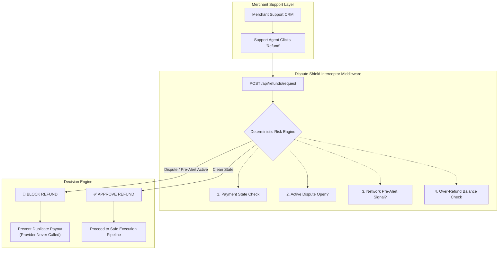
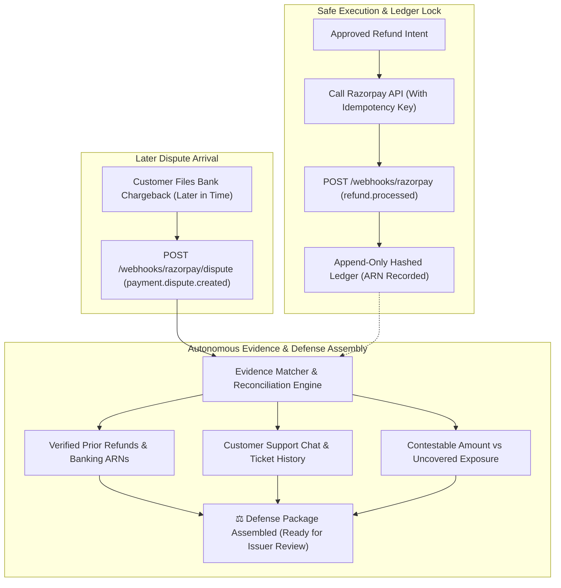

# 🛡️ Dispute Shield

> **Track: AI Finance Controller — Razorpay Buildathon**

**Dispute Shield is a smart middleware layer that intercepts customer support refunds to block double-charges when a bank dispute is already brewing, and automatically builds ironclad evidence packages if a customer files a chargeback later.**

---

## The Problem We Solve

When a customer contacts support requesting a refund, the support agent has **zero visibility** into whether the bank has already received a dispute signal for the same payment.

If the agent processes the refund while a dispute is in flight:

- The merchant pays **twice** — once via the voluntary refund, once via the chargeback
- No structured evidence is ever assembled for the dispute
- The duplicate outflow is **entirely avoidable** with the right middleware

> Existing reconciliation tools operate **after the fact**. Dispute Shield sits in the critical path **before money moves**.

---

## 🌐 Live Demo

🔗 **Interactive Frontend:** [https://dispute-shield-beta.vercel.app/](https://dispute-shield-beta.vercel.app/)  
🔗 **API Docs (Swagger UI):** [https://dispute-shield-production-be56.up.railway.app/docs](https://dispute-shield-production-be56.up.railway.app/docs)  
🔗 **Live Backend Service:** [https://dispute-shield-production-be56.up.railway.app/](https://dispute-shield-production-be56.up.railway.app/)

The project includes a **story-driven interactive simulator** — judges can select a story, step through it, and observe real-time middleware risk checks and defense assembly.

**8 built-in scenarios:**

| Story | What it demonstrates |
|---|---|
| ⚡ A Dispute Is Brewing | Pre-dispute alert blocks refund (HERO scenario) |
| ⚔️ A Chargeback Is Already Open | Active dispute blocks refund — double liability prevented |
| 🕵️ Refunded — Then Charged Back | Merchant refunds, customer still files chargeback — auto-defense built |
| ✅ A Normal Refund | Clean path — approved, processed, ARN issued |
| ⚖️ Partial Refund, Full Chargeback | Partial coverage quantified — ₹6K covered, ₹4K exposed |
| 🔄 The Webhook Arrived Twice | Idempotent processing — one financial effect |
| ⏱️ The Network Went Down | Safe retry with idempotency key |
| 🔀 Events Arrived Out of Order | Financial state cannot regress |

Each scenario tells a human story (Ramu's ₹5,000 jacket) before revealing the technical decision.

---

## How It Works: Prevent → Execute → Defend

The system operates across two core operational phases:
 
### Phase 1: Real-Time Interception (Prevent)
When a customer support agent initiates a refund, Dispute Shield intercepts the call **before** the payment processor is contacted. It evaluates active chargeback states, pre-dispute alerts (Visa/Mastercard feeds), and remaining balances to block duplicate outflows.



---

### Phase 2: Ledger Confirmation & Automated Defense (Execute & Defend)
If cleared, the refund is executed with an idempotency key and confirmed via webhook to an append-only hashed ledger. When a bank dispute arises later in time, the defense engine automatically reconciles prior refunds, extracts ARNs, gathers customer support logs, and generates a structured defense package.




---

**The financial safety decision is strictly deterministic — rule-verified before payment execution.**

The system ensures that money-movement logic is 100% verifiable and grounded in ledger state.

---

## AI Finance Controller Track Fit

This project addresses three pillars of the AI Finance Controller track:

| Pillar | What Dispute Shield Delivers |
|---|---|
| **Real-time financial safety** | Intercepts refund requests in the critical path before provider API is called |
| **Automated dispute intelligence** | Assembles evidence packages from structured data on every `payment.dispute.created` webhook |
| **Financial visibility** | Live FinOps metrics: duplicate outflow prevented, evidence coverage, defense readiness |

**Why this is not just a reconciliation dashboard:**
Reconciliation is retrospective — it tells you after the double-payment has occurred. Dispute Shield is prospective — it prevents the duplicate outflow from happening.

---

## Architecture

### Stack

| Layer | Technology |
|---|---|
| API | FastAPI (Python) |
| Database | PostgreSQL 18 |
| ORM | SQLAlchemy 2.0 |
| Webhook simulation | In-process provider boundary (Razorpay API contract) |
| Frontend | Vanilla HTML/CSS/JS (story-based simulator) |

### Core Domain Models

```
Payment          → CAPTURED
RefundIntent     → CHECKING → APPROVED → EXECUTING → PENDING → PROCESSED
                          → BLOCKED
Refund           → PENDING → PROCESSED (with ARN)
Dispute          → OPEN
DefensePackage   → READY | PARTIALLY_DEFENSIBLE | INCOMPLETE
LedgerEvent      → append-only, hashed, never mutated
ProviderEvent    → idempotency layer for webhook deduplication
```

### Key Safety Properties

- **Idempotency keys** — same key always resolves to the same provider refund
- **Webhook deduplication** — `provider_events` table prevents duplicate ledger effects
- **Row-level locking** — `SELECT FOR UPDATE` on payment during refund request
- **Out-of-order protection** — PROCESSED + stale webhook → `already_processed` (no regression)
- **No fake 2PC** — external provider not in our DB transaction; idempotency + outbox instead
- **Integer paise arithmetic** — no floating point in financial calculations

### Evidence Pipeline

| Evidence Type | Source | When Present |
|---|---|---|
| `refund_confirmation` | Refund record (ARN, amount, timestamp) | When PROCESSED refunds exist |
| `customer_communication` | SupportMessage records | When support messages exist |
| Missing evidence | Explicitly named in defense summary | Always — never hallucinated |

---

## API Reference

| Endpoint | Purpose |
|---|---|
| `POST /api/refunds/request` | Intercept + risk-check a refund request |
| `GET /api/state/{payment_id}` | Live payment + refund + dispute state |
| `GET /api/defense/{dispute_id}` | Assembled defense package + evidence |
| `GET /api/metrics` | FinOps metrics (blocked count, amounts, coverage) |
| `POST /api/scenarios/load/{name}` | Seed one of 8 demo scenarios |
| `POST /api/scenarios/reset` | Wipe all demo data |
| `POST /webhooks/razorpay` | Handle `refund.processed` events (idempotent) |
| `POST /webhooks/razorpay/dispute` | Handle `payment.dispute.created` events |

---

## Quick Start (Local)

### Prerequisites
- Python 3.13+
- PostgreSQL running on `localhost:1234`, database `dispute-shield`
- `.env` with `DATABASE_URL=postgresql://...`

### Run locally in 4 commands

```powershell
# 1. Install dependencies
.venv\Scripts\pip install -r requirements.txt

# 2. Initialise the database
.venv\Scripts\python.exe -m app.db.init_db

# 3. Start the backend
.venv\Scripts\uvicorn.exe app.main:app --host 0.0.0.0 --port 8000 --reload

# 4. Start the frontend (new terminal)
.venv\Scripts\python.exe -m http.server 3000 --directory frontend
```

### Run Tests

```powershell
.venv\Scripts\python.exe -m pytest tests/ -v
# Expected: 13 passed
```

---

## Project Structure

```
dispute-shield/
├── app/
│   ├── main.py              # FastAPI app, all API routes, webhook handlers
│   ├── db/
│   │   ├── models.py        # SQLAlchemy ORM models
│   │   └── init_db.py       # Schema initialisation
│   ├── domain/
│   │   ├── risk_engine.py   # Deterministic refund safety decision
│   │   ├── refund_service.py
│   │   ├── refund_execution.py
│   │   └── defense_service.py
│   └── providers/
│       └── razorpay_mock.py # Razorpay API boundary with idempotency
├── frontend/
│   ├── index.html           # Story-driven simulator shell
│   ├── app.js               # Story engine + backend API calls
│   └── styles.css           # Dark fintech UI
├── tests/
│   └── test_scenarios.py    # 13 integration tests (all passing)
├── docs/
│   └── demo-script.md       # Step-by-step judge demo guide
└── requirements.txt
```

---

*Razorpay Buildathon — AI Finance Controller Track*
